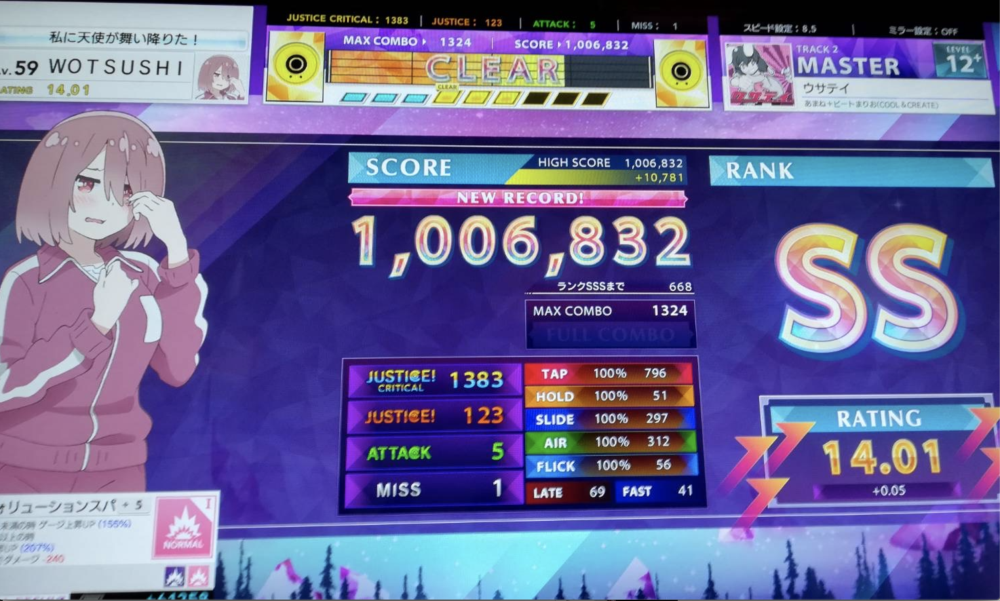

ウサテイありがとう

## History

### 2020年1月

初プレイ。ほとんどやってない。ADVANCEDもろくにできなかった。
片手でホールドしているときにもう片方の手でタップが来るとホールドの手も離れてミスりまくったのはいい思い出。

### 2020年2月

それなりの頻度でゲーセンに行き始めた。レート10くらいになった。
EXPERTで手をクロスする技術が必要になってきた。
TAP&AIRもだいぶ苦手意識があった気がする。

### 2020年3月

ここから手袋をつけてやるようになった。手袋でスライドが一気にやりやすくなって感動した記憶がある。
レベル10のEXPERTくらいは遊べるようになった。レベル9の得意な奴は鳥とったはず。
おそらくレート11くらい。
コロナで中旬くらいからゲーセンに行かなくなった。

### 2020年4月

コロナでお休み

### 2020年5月

コロナでお休み

### 2020年6月

久々に再開。再開直後はEXPERTまったくできなくなっているかと思いきやレベル8くらいはAJとれた。
それなりに順調にリハビリできたと思う。レートは11くらいのままだったと思う。

### 2020年7月

ようやく銅レに乗った。MASTER初鳥はLemon. 全難易度の入門としてお世話になった。
レベル11にも挑戦し始めた。ポプアニのMASTERが触れるようになったのはかなり嬉しかった。
レート12.5でしばらく停滞したが指押しを意識することで停滞を脱することができた（まだまだできないけど...）。

### 2020年8月

銀レに乗った。レベル11+〜12も触れるようになってきて曲の選択肢が大きく増えた。
銀レになった後も停滞することなくレートは増加し13.32まで上がった。

### 2020年9月

銀レ折返し。13.32 -> 13.66
レベル12をとにかくプレイした。レベル11の鳥がそれほど珍しくなくなってきた。
11+は好きな曲以外あまり触れていない

### 〜2020年10月18日

ついに金レ。13.66 -> 14.03
やはりレベル12をとにかくプレイした。レベル11の鳥も1日1, 2曲は埋められている。
レベル12の鳥も出せるようになった。レベル12は6曲で鳥をとった。
12+, 13は太刀打ちできるものしかやっていないし、それほど探索もできていない。

## レートに貢献したと思われる曲たち

チュウニズムNETに加入していないので正確なベスト枠はわからないため記憶を頼りに書く。

- 13
  - レータイスパークex(13.3): 990k(13.9)
  - 殺人レコード恐怖のメロディ(13.3): 985k(13.7)
  - BOKUTO(13.0): 990k(13.6)
- 12+
  - ウサテイ(12.8): 1006.5k(14.6)
  - Doll Judgment(12.8): 1003k(14.1)
  - ドーナツホール(12.7): 1001k(13.8)
- 12
  - Rightfully(12.6): 1001k(13.7)
  - Deal with the devil(12.6): 1007k(14.5)
  - God knows(12.3): SSS(14.3)
  - ヒプノシスマイク -Division Battle Anthem-(12.2): 1007k(14.1)
  - 徒花ネクロマンシー(12.2): SSS(14.2)
  - ハッピー・ハッピー・フレンズ(12.4): 1006.5k(14.2)
  - Star Divine(12.0): SSS(14.0)
  - ナンセンス文学(12.0): SSS(14.0)
  - Catch the Wave(12.1): SSS(14.1)
  - ブレス・ユア・ブレス(12.5): 1007k(14.4)
  - POP TEAM EPIC(12.0): 1007k(13.9)
  - ロスタイムメモリー(12.4): 1005k(13.9)
  - パーフェクト生命(12.6): SSS(14.6)
- 11+
  - 紅蓮華(11.9): SSS(13.9)
  - 前前前世(11.9): 1007k(13.8)
  - 青空のラプソディ(11.8): SSS(13.8)
  - ヒトリゴト(11.7): SSS(13.7)
  - adrenaline!!!(11.7): 1007k(13.6)
- 11
  - ホシトハナ(11.6): SSS(13.6)
  - true my hear -Lovable mix-(11.6): SSS(13.6)
  - メルト(11.6): SSS(13.6)
  - Bravely You(11.6): SSS(13.6)

はい、鍵盤できない人です。

## 次の目標

〜2021年6月30日にプラレになりたい。2020年内は14.2くらいまで上がれば。
