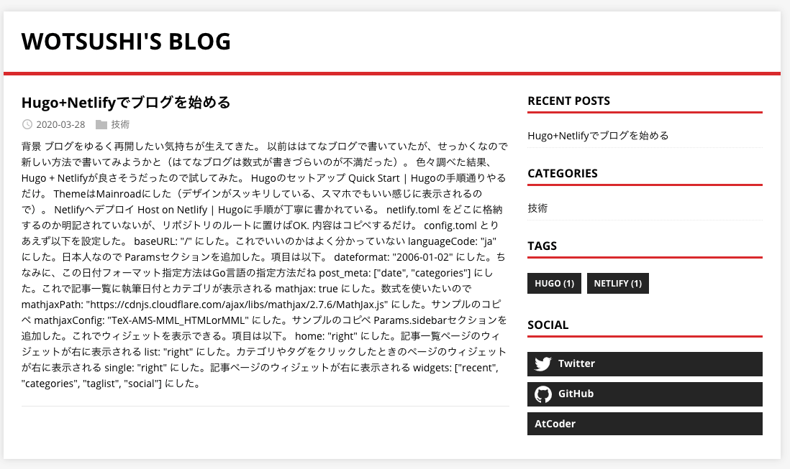

# 背景
ブログをゆるく再開したい気持ちが生えてきた。
 以前ははてなブログで書いていたが、せっかくなので新しい方法で書いてみようかと（はてなブログは数式が書きづらいのが不満だった）。
 色々調べた結果、Hugo + Netlifyが良さそうだったので試してみた。

# Hugoのセットアップ
[Quick Start | Hugo](https://gohugo.io/getting-started/quick-start/)の手順通りやるだけ。
 Themeは[Mainroad](https://github.com/vimux/mainroad/)にした（デザインがスッキリしている、スマホでもいい感じに表示されるので）。

# Netlifyへデプロイ
[Host on Netlify | Hugo](https://gohugo.io/hosting-and-deployment/hosting-on-netlify/)に手順が丁寧に書かれている。
`netlify.toml` をどこに格納するのか明記されていないが、リポジトリのルートに置けばOK.
内容はコピペするだけ。

# config.toml
とりあえず以下を設定した。

- baseURL: `"/"` にした。これでいいのかはよく分かっていない
- languageCode: `"ja"` にした。日本人なので
- Paramsセクションを追加した。項目は以下。
  - dateformat: `"2006-01-02"` にした。ちなみに、この日付フォーマット指定方法はGo言語の指定方法だね
  - post_meta: `["date", "categories"]` にした。これで記事一覧に執筆日付とカテゴリが表示される
  - mathjax: `true` にした。数式を使いたいので
  - mathjaxPath: `"https://cdnjs.cloudflare.com/ajax/libs/mathjax/2.7.6/MathJax.js"` にした。サンプルのコピペ
  - mathjaxConfig: `"TeX-AMS-MML_HTMLorMML"` にした。サンプルのコピペ
- Params.sidebarセクションを追加した。これでウィジェットを表示できる。項目は以下。
  - home: `"right"` にした。記事一覧ページのウィジェットが右に表示される
  - list: `"right"` にした。カテゴリやタグをクリックしたときのページのウィジェットが右に表示される
  - single: `"right"` にした。記事ページのウィジェットが右に表示される
  - widgets: `["recent", "categories", "taglist", "social"]` にした。下図のようなウィジェットが表示される
- Params.widgetsセクションを追加した。
  - tags_counter: `true` にした。タグごとの記事数が(17)のように表示される
- Params.widgets.socialセクションを追加した。一部のサービス（mainroadの公式ページ参照）であればアカウント名指定するだけでいい感じに表示される。今回はTwitterとGitHubを指定した。それ以外のサービスについてはParams.widgets.social.customでtitle, url, iconを指定する。今回はAtCoderを指定した（アイコンはきれいに出せなかったので諦めた）



`config.toml` は以下となった。

```toml
baseURL = "/"
languageCode = "ja"
title = "wotsushi's blog"
theme = "mainroad"

[Params]
  dateformat = "2006-01-02"
  post_meta = ["date", "categories"]
  mathjax = true # Enable MathJax
  mathjaxPath = "https://cdnjs.cloudflare.com/ajax/libs/mathjax/2.7.6/MathJax.js" # Specify MathJax path
  mathjaxConfig = "TeX-AMS-MML_HTMLorMML" # Specify MathJax config

[Params.sidebar]
  home = "right" # Configure layout for home page
  list = "right"  # Configure layout for list pages
  single = "right" # Configure layout for single pages
  widgets = ["recent", "categories", "taglist", "social"]

[Params.widgets]
tags_counter = true

[Params.widgets.social]
github = "wotsushi"
twitter = "wotsushi"

[[Params.widgets.social.custom]]
  title = "AtCoder"
  url = "https://atcoder.jp/users/wotsushi"
```

# 数式を`$`で囲うだけで表示できるようにする
デフォルトだとインラインの数式を書く場合 `\\(` と `\\)` で囲う必要があって面倒。
`layouts/partials` ディレクトリを作成し、以下の内容の `layouts/partials/footer.html` を作成すると、`$` で囲うだけで数式を出せる。

```html
<script type="text/x-mathjax-config">
  MathJax.Hub.Config({
      tex2jax: {inlineMath: [['$','$'], ['\\(','\\)']]}
  });
</script>
```

各記事で共通して実行させたいスクリプトを `layouts/partials/footer.html` に書くのだろう。

# 画像を楽に貼り付けられるようにする
私はVSCodeでmarkdownを執筆しているので、[Paste Image - Visual Studio Marketplace](https://marketplace.visualstudio.com/items?itemName=mushan.vscode-paste-image) プラグインを導入した。
これで、ショートカット一つで画像をmarkdownに貼り付けられる（画像ファイルはmarkdownファイルと同一のディレクトリに保存される）。

しかし、このままHugoに画像が表示されない。どうもディレクトリ構造を以下のように`content-posts-記事名-index.md`のような構造に変える必要があるみたい。

```
$ tree content
content
└── posts
    └── hugo_install
        ├── 2020-03-28-16-17-18.png
        └── index.md

2 directories, 2 files
```

ファイルとしてはスッキリするのでこれでいいとは思う。
