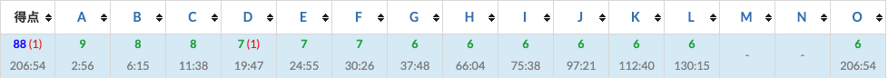

## 参加情報
- コンテストURL: https://atcoder.jp/contests/past202004-open
- 参加日時: 2020年5月4日 13:00-18:00

あくまでバチャ。

## 結果

88点（上級）。

## ログ

### A
やるだけ。PASTのAは文字列絡みでAにしてはダルい...

### B
やるだけ。 `(char)(x)` で `int` の値 `x` を `char` に変換できることに気づくのに少し時間かかった（ `vector` ではなく `map` 使えばよかったかも）。

### C
やるだけ。横Nマスと勘違いして、サンプル3でやたらXが足りなかった（親切なサンプル）。

### D
英小文字、ピリオドの27種類の文字から成る長さ3以下の $T$ を全列挙して $S$ にマッチする文字列をカウントした。
$S$ を元にマッチする文字列を生成する方針も一瞬考えたが、ダルそうなのでやめた。
$|S| = 1, 2$ のケースに注意。これ考慮せずに1RE生やした（PASTはペナないけど）。

### E
やるだけ。 順列なのでループ回数は $N$ 以下である。

### F
貪欲したくなる。タスクに期限はないので、貪欲で後悔することはなさそう。
$k$ ごとに異なる選び方をするのでは？と一瞬思ったが、貪欲なのでそんなことはない。
優先度付きキューで突っ切りながら順に和を出力するだけ。

### G
そろそろやるだけではなさそうなオーラを感じる。
真面目に追加クエリを処理して間に合うか？
制約をみると $Q, X_i \leq 10^5$ なので無理だと分かる。
ランレングス圧縮が頭に過るが、そもそも追加クエリを処理せずにそのまま保持すればよさそう。
削除クエリを処理する際に追加クエリを評価する感じ。
保持しているクエリのリストについて、追加クエリはリスト末尾に追加、削除クエリはリスト先頭から削除なので、dequeの出番。
2乗和を計算するために使うカウンターは `map<char, ll>` でも使えばよい。

### H
問題文が難しい。「この順に含む」を「初めて0を通る移動、初めて1を通る移動、...、初めて9を通る移動」を部分列として含むという意味だと誤解してしまった（例えば `S2123456789G` のような移動はNGだと思っていた。1のあとに2を通っていれば、1の前に2を通っていてもOK）。

理解しても少し難しいが、落ち着いて状態空間を考えると、マスと達成したノルマの直積しかないことが分かる。
マスは $MN \leq 50 \times 50 = 2500$ であり、ノルマは10種類なので状態空間のサイズは僅か25,000。
よって、状態空間に対してBFSするだけである。

構造化束縛した変数を無名関数から参照するとVSCodeがうるさいので、構造化束縛を諦めたが、実はふつうにコンパイルは通るので無視してよい。

### I
なんか効率的に解けと言っている雰囲気を出している問題だが、念のため愚直にやった場合の計算量を見積もると $2^{16} + 2^{15} + \cdots + 2^1 < 2^{17}$ となり、愚直にやるだけになってしまった。

### J
実装の圧を感じる問題。指数的に文字数増えてヤバそうだなと思ったら、制約で最終的な文字列は高々1000以下になると書いてある。
まあ巨大な文字列を出力していたらTLE必至なので当然か。
という訳でスタックに積みながらやるだけ。こういうの久々にやったので20分くらいかかってしまった。

### K
また括弧かってなった。とても難しそうだが、制約 $N \leq 3000$ を見て、$O(N^2)$ のDPなんだろうなと推測できる。
状態空間として、$i$ 文字目時点での閉じていない括弧の個数 $j$ をとりたくなる（各開き括弧がどこから開いているかなんて興味ないので）。
そうすると $i$ 文字目が開き括弧ならば $dp_{i, j} = \min{(dp_{i - 1, j - 1}, dp_{i - 1, j + 1} + C_i, dp_{i - 1, j} + D_i)}$ のような漸化式が成り立ちそう。閉じ括弧も似たような感じ。
あとは漸化式を計算するだけ。

### L
辞書順は貪欲な気持ちが大事。なので、最小値を先頭に置きたいが後ろの要素を選ぶと詰むことがありそう。
なので、詰まない範囲での最小値を選ぶことを繰り返せばよさそう。
最小値が複数ある場合は、前方を優先して損することはなさそう。
辞書順なので、出し惜しみは一切不要 （`(1, 9, 9) < (2, 1, 1)` なのだ）。
範囲の最小値を選ぶ作業はセグ木で殴ってしまった（更新しないのにセグ木使う奴）。
解説に書いてあるが、優先度付きキューでも解ける。

### M
少し読んでダルそう〜ってなってしまった。
社員1人でもややきつい印象。とりあえずサイクルを検出して、余りを処理すればいけそう。
このやり方だと $N$ 人はTLEする。
ここで、 $L$ が全社員共通なので、怪しさを感じる。
事前に $D$ 日間のメニューについて、料理ごとにグループ分けしておいて、一周の長さと一周に含まれる好みの料理数を前計算しておけばいけそうな気がするが、実装で禿げそうなので撤退してしまった。

### N
Mがダルいと確信したので最後はNに粘着していたがダメだった。
二次元の問題は一次元から考える習慣がある。
一次元なら累積和で楽勝！
二次元は...難しいな。当然だがx軸とy軸で独立に考えてもうまくいかない。
二次元累積和で検索しても $O(HW)$ のアルゴリズムばっかり出てきてつらい気持ちになる。
x座標ごとに各敷地の端点のy座標を入れてあげればうまくいきそうな気がしたがタイムオーバー。

### O
シンプルな問題で好感が持てる。
結果論だが、Oを先にやったのは正解だった。
サンプルで遊んでみると、通常の最小全域木から辺を1本除き、指定した辺を追加する形になりそうだと観察される。
除く辺は何か？冗長な辺（全域木となるために不要な辺）のうち、重みが最大の辺でよさそう。
つまり、辺を追加して生ずるサイクルについて、そのサイクルに含まれる重みが最大の辺を除けばよい。
これは適当な頂点を根とした最小全域木について、追加辺の端点となる2頂点のLCAを求め、LCAまでの辺のうち最大の重みをとればよい。
LCAライブラリを少しいじったらすんなり通った。
辺の重みに関する関数を適用した値を返すように、LCAライブラリを拡張してもいいかもしれないと思った（やりすぎ？）

## 感想
- ライブラリに困ることはなく、前回より楽に上級ラインに入れた
- NではなくMに粘着していれば94点いけた気がしなくもない
- 解説読むとNはソートで割と楽に解けそう。これは精進不足
- Lまでは悪くない動きだったと思う。Oも着手してから解くまでに要した時間は悪くない
- これを2時間以内に全完する人類強すぎ